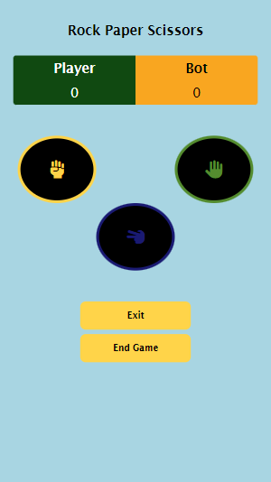
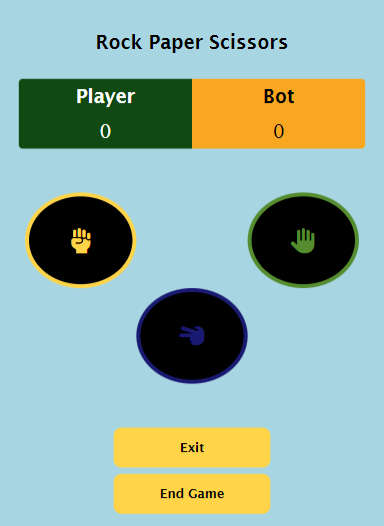
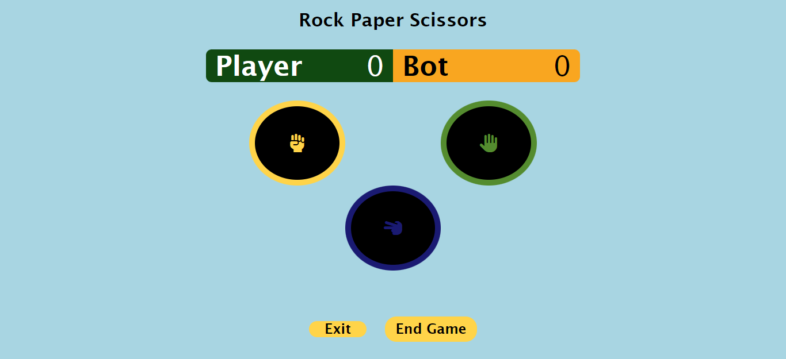

# Rock Paper SicssorsGame
# Scrimba frontend learning Path

This is a rock paper sicssors game designed and created by yours truly Ibimina Hart

## Table of contents

- [Overview](#overview)
  - [The challenge](#the-challenge)
  - [Screenshot](#screenshot)
  - [Links](#links)
- [My process](#my-process)
  - [Built with](#built-with)
  - [Continued development](#continued-development)
- [Author](#author)

## Overview

### The challenge

Users should be able to:

- View the optimal layout for the site depending on their device's screen size
- Play a game with computer opponent
- Return to continue game if the exist button/link is click
- See the user clicked button and computer chosen option
- End game and start a new one
- Read the rules of the game

### Screenshot




### Links

- Solution URL: (https://github.com/ibimina/rock-paper-scissors-game)
- Live Site URL: (https://ibimina.github.io/rock-paper-scissors-game/)

## My process

### Built with

- Semantic HTML5
- CSS custom properties
- Flexbox
- Grid
- Mobile-first workflow


### Proud of this 
This enables the user to continue game from where they stopped without reloading the page
```js
if (localStorage.getItem("human") && localStorage.getItem("comp")) {
  humanScore.textContent = localStorage.getItem("human");
  computerScore.textContent = localStorage.getItem("comp");
}
```

This resets the game for a user to a new game
```js
const cls = () => {
  localStorage.human = 0;
  localStorage.comp = 0;
  humanScore.textContent = localStorage.getItem("human");
  computerScore.textContent = localStorage.getItem("comp");
};
```
### Continued development

Javascript and React framework


## Author

- Ibimina Hart
 - Frontend Mentor - [ibimina](https://www.frontendmentor.io/profile/ibimina)
 - Linkedin - [ibimina hart](https://www.linkedin.com/in/ibimina-hart)
- Twitter - [ibiminaaH](https://www.twitter.com/ibiminaaH)


